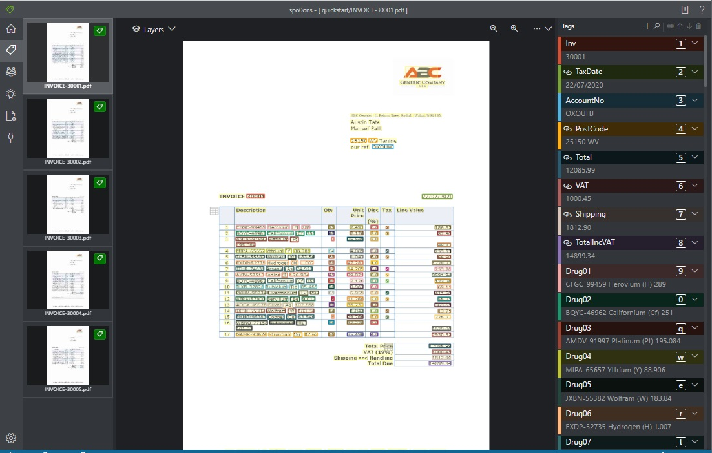
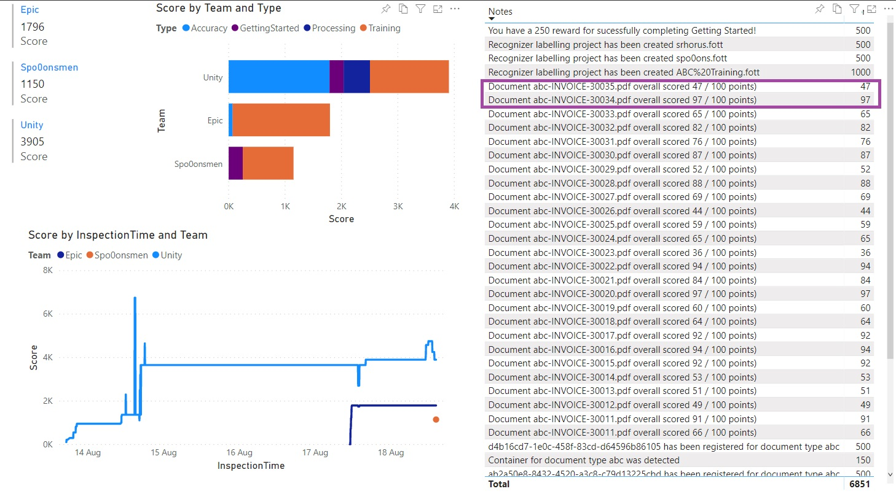

# Create your first custom labelling project

When you use the Form Recognizer custom model, you provide your own training data so the model can [train to your industry-specific forms]{(https://docs.microsoft.com/en-us/azure/cognitive-services/form-recognizer/build-training-data-set}. If you're training without manual labels, you can use five filled-in forms, or an empty form (you must include the word "empty" in the file name) plus two filled-in forms. Even if you have enough filled-in forms, adding an empty form to your training data set can improve the accuracy of the model.

If you want to use manually labeled training data (which we do), you must start with at least five filled-in forms of the same type. You can still use unlabeled forms and an empty form in addition to the required data set.

The setup workflows have given you a jump start in Model Training.  The training storage account already has a container created for document format **abc**.  5 sample documents have been uploaded to that container, along with tag definiton files and tagging for each of the sample documents.

You'll need to create a labelling project (its not currently possible to automate this).  The instructions are as follows:

1. Identify the shared access signature for the **abc** container withing the training storage account. This *SASUrl* is created as part of the installation and is printed to the log at the end of the Processing Infrastruture github action.  Look in the logs to identify the Url.  If you are familar with this you could create another one using the portal or Azure Storage Explorer.
2. Download and run the labelling tool (linux) docker container:

&nbsp;&nbsp;&nbsp;&nbsp;&nbsp;&nbsp;&nbsp;`docker pull mcr.microsoft.com/azure-cognitive-services/custom-form/labeltool`

&nbsp;&nbsp;&nbsp;&nbsp;&nbsp;&nbsp;&nbsp;`docker run -it -p 3000:80 mcr.microsoft.com/azure-cognitive-services/custom-form/labeltool eula=accept`

3. Browse to http://localhost:3000

This should load the custom labelling tool.  



Follow the [instructions] (https://docs.microsoft.com/en-us/azure/cognitive-services/form-recognizer/quickstarts/label-tool#label-your-forms) to create a new project, but use the SasUrl identified in step 1 above when creating your connection.  Even though you are creating a new project this should do so including the pre-prepared assets that we deployed as part of set-up.  In this way you should be able to step strainght to the [train a custom model] (https://docs.microsoft.com/en-us/azure/cognitive-services/form-recognizer/quickstarts/label-tool#train-a-custom-model) and avoid most of the tagging legwork.

> In testing the SasUrl generated by the deployment has sometimes meant that the labelled documents arent loaded correctly.  In that case generate a new SasUrl for the training storage account container **abc** and use that instead.

At this stage you should have a screen in your labelling tool that looks like this:


And it's time to submit a Training Request.

___you will also need to create custo labelling projects for the other two document formats (oscorp and neuryon)___

## Submit a Training Request

Submitting a training request triggers the [model training workflow](https://github.com/nikkh/Horus#model-training) in the horus application. The simplest way to submit a request is do so by sending an http POST message to the processing function app (app-func).  The function that triggers a training request is HttpTrainRequest.

In order to send a requestr to an Azure funciton you need to send a security code as part of the request.  This code can be obtained from the Azure Portal as described in [this](https://docs.microsoft.com/en-us/azure/azure-functions/functions-bindings-http-webhook-trigger?tabs=csharp#obtaining-keys) document.

Using Postman or similar construct a body as follows:

````
{
  "SasUrl": "your SasUrl as in the custom labelling project above",
  "Items": [
    {
      "DocumentFormat": "abc",
      "BlobFolder": "quickstart"
    }
  ]
}
````

Post that body to the following url:

`https://app-func.azurewebsites.net/api/HttpTrainRequest?code="your function code"`

This will post a message onto the training-requests queue and cause a model to be trained based on the traaining assets in your training stroage account.  Once the model is successfully trained, a record is kept as control data in the application Sql DB and this newly trained model will be used for all subsequent document processing / recognition  for this document type (unless the model is retrained using another similar request).

## Submit some 'Previously Unseen' documents

Sample documents are stored in GitHub along with everything else.  Samples are present in the [Generator project](https://github.com/nikkh/Horus/tree/master/Horus.Generator/Documents).  There is a directory for each fictious supplier (abc, oscorp and neuryon).  Documents in the range 30001-30010 are intended as training documents (you can process them but you will not gain any scores for doing so) documents 30011 onwards unseen, you can upload them without the system ever having encountered them before and they should still be recognised.

Once your model has been trained for a particular document format, then you are ready to process some previously unseen documents.  These documents have not been used as part of the training cycle and can now be recognized and processed automatically, ven though they have never been seen before.  ___This is the essence of the value of Forms Recognizer___. You train a model for each type (format) of document that you recieve, and then all future documents of that type can be recognised automatically.

Let's get going.  You will remember from the description of resources that there is a staging storage account automatically created by the deployment. it should be called `app-random-stage`.  This strage account is monitored by an Event Grid subscription so whatever containers  you create, uploading a document into those containers will cause the subscription to fire and place message on the *incoming-documents* service bus queue.

The first thing that happens then is that the document is renamed to include the document format in the name.  In our case we are currently working with the *abc* format - so if we upload invoice1.pdf it will be renamed to abc-invoice1.pdf and it will be referenced thus for the rest of the workflow.

Ensure that there is a container called 8abc* in the staging storage account.  Then (using [Storage Explorer](https://azure.microsoft.com/en-us/features/storage-explorer/) or Azure Portal), upload a document to the abc container.  After a few seconds the document should disappear - this is becasue it has been renamed and moved to the orchestration container for the workflow that is processing it.

After a minute or so, processing should have finished.  The simplest way to check this is to access the Sql databse using Sql Server Management Studio or your favourite tool.  The connection string for the processing database can be found int he app-func configuration.  Use this to access the database.  The documents table should now contain a record for the invoice that you uploaded.  Repeat with a couple of other of the same documents.

Scores will be updated after a maximum of 5 minutes.  if you check the scoreboard at this point you should see you have received some points for processing an unseen document:



>Notice the hightlights documents on the scoreboard image - one has an accuracy of 97%, the other has 47%.  Why is this?  See the next section [Understanding what happened during the recognition process](https://github.com/nikkh/Horus/blob/master/help.md#understanding-what-happened-during-the-recognition-process) to learn more.

# Understanding what happened during the recognition process

There are a number of ways to understand what happened during recognition:

1. Look at the document errors in the database
2. Look at the job log for each individual processing run
3. Look at Application Inights for the processing run
4. Lok at application insights for the scoreboard calculation (inspection)

Of there, items 1-3 are always available.  item is only available if you are taking part in a challenge or have deployed your own scorecard infrastructure.

Each of these options is breifly explained below:

## DocumentErrors Database Table
## Job Log
## Application Insights for Processing
## Application Insights for Inspection

