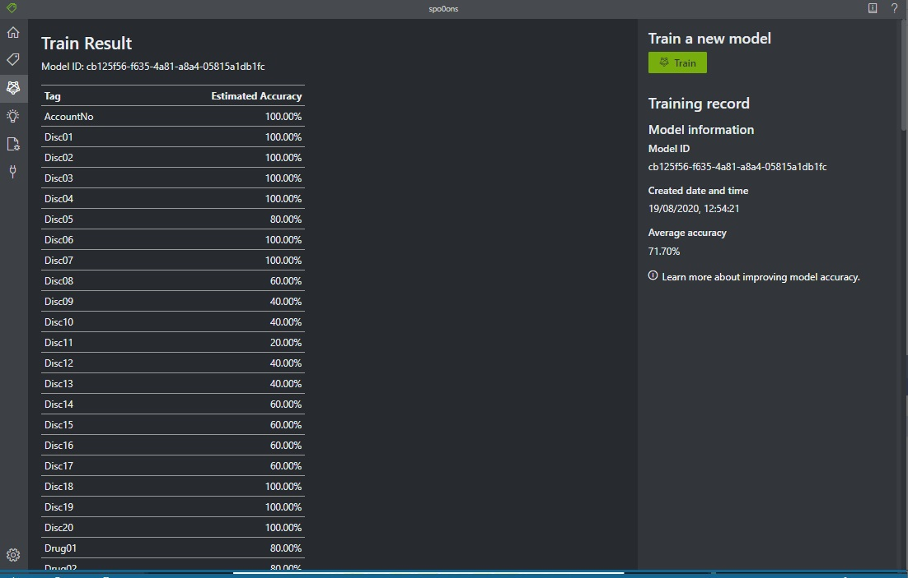

# Create your custom labelling project

When you use the Form Recognizer custom model, you provide your own training data so the model can [train to your industry-specific forms]{(https://docs.microsoft.com/en-us/azure/cognitive-services/form-recognizer/build-training-data-set}. If you're training without manual labels, you can use five filled-in forms, or an empty form (you must include the word "empty" in the file name) plus two filled-in forms. Even if you have enough filled-in forms, adding an empty form to your training data set can improve the accuracy of the model.

If you want to use manually labeled training data (which we do), you must start with at least five filled-in forms of the same type. You can still use unlabeled forms and an empty form in addition to the required data set.

The setup workflows have given you a jump start in Model Training.  The training storage account already has a container created for document format **abc**.  5 sample documents have been uploaded to that container, along with tag definiton files and tagging for each of the sample documents.

You'll need to create a labelling project (its not currently possible to automate this).  The instructions are as follows:

1. Identify the shared access signature for the **abc** container withing the training storage account. This *SASUrl* is created as part of the installation and is printed to the log at the end of the Processing Infrastruture github action.  Look in the logs to identify the Url.  If you are familar with this you could create another one using the portal or Azure Storage Explorer.
2. Download and run the labelling tool (linux) docker container:

&nbsp;&nbsp;&nbsp;&nbsp;&nbsp;&nbsp;&nbsp;`docker pull mcr.microsoft.com/azure-cognitive-services/custom-form/labeltool`

&nbsp;&nbsp;&nbsp;&nbsp;&nbsp;&nbsp;&nbsp;`docker run -it -p 3000:80 mcr.microsoft.com/azure-cognitive-services/custom-form/labeltool eula=accept`

3. Browse to http://localhost:3000

This should load the custom labelling tool.  Follow the [instructions] (https://docs.microsoft.com/en-us/azure/cognitive-services/form-recognizer/quickstarts/label-tool#label-your-forms) to create a new project, but use the SasUrl identified in step 1 above when creating your connection.  Even though you are creating a new project this should do so including the pre-prepared assets that we deployed as part of set-up.  In this way you should be able to step strainght to the [train a custom model] (https://docs.microsoft.com/en-us/azure/cognitive-services/form-recognizer/quickstarts/label-tool#train-a-custom-model) and avoid most of the tagging legwork.

> In testing the SasUrl generated by the deployment has sometimes meant that the labelled documents arent loaded correctly.  In that case generate a new SasUrl for the training storage account container **abc** and use that instead.

At this stage you should have a screen in your labelling tool that looks like this:

## Submit a Training Request

## Submit some 'Previously Unseen' documents
